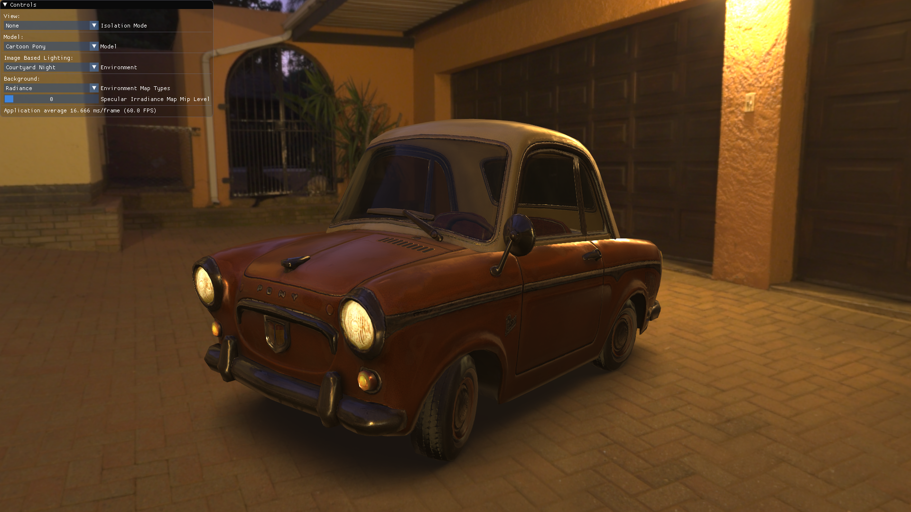

# Poirot

This project is a study into Direct3D 12, Physically Based Shading and Modern C++ (C++17). Even though I had read extensively about these topics, I never had the chance to have any practical experience in them until now. For the moment, Poirot is a limited capability [gltf 2.0](https://github.com/KhronosGroup/glTF/tree/master/specification/2.0) scene viewer, 
but it will hopefully transform into an inspector module for my rendering framework Octarine. Which should explain its name.  

# Prerequisites

The project is set to be built with the following configurations:
* Windows 10 SDK (10.0.17134.0)
* Visual Studio 2017 (v141)
* A D3D_FEATURE_LEVEL_12_0 capable GPU. (Unfortunately, I could only test on a RX480 with Radeon Software version 18.7.1)

# Build Instructions

The repository contains Visual Studio 2017 project files that are ready to build on Windows 10. 
Only external dependencies are [Dear Imgui](https://github.com/ocornut/imgui), [tinygltf](https://github.com/syoyo/tinygltf), and [stb](https://github.com/nothings/stb) libraries and all of them are included in the project.

# Third Party Licences
* Libraries:
  * Dear Imgui : MIT License
  * tinygltf : MIT License
  * stb : Public Domain
 * Assets:
    * [Combat Vehicle Crewman (CVC) Helmet, Vietnam Era](https://sketchfab.com/models/c1516dc3d0ea420b9246334a94e5681e) by [olmopotums](https://sketchfab.com/olmopotums) : CC BY 4.0
    * [Battle Damaged Sci-fi Helmet - PBR](https://sketchfab.com/models/b81008d513954189a063ff901f7abfe4) by  [theblueturtle_](https://sketchfab.com/theblueturtle_) : CC BY-NC 4.0
    * [Pony Cartoon](https://sketchfab.com/models/885d9f60b3a9429bb4077cfac5653cf9) by [Slava Z.](https://sketchfab.com/slava) : CC BY 4.0
    * [Vintage Suitcase](https://sketchfab.com/models/4097027ee5e246579cf80a23aab1522c) by [romullus](https://sketchfab.com/romullus) : CC BY-SA 4.0
